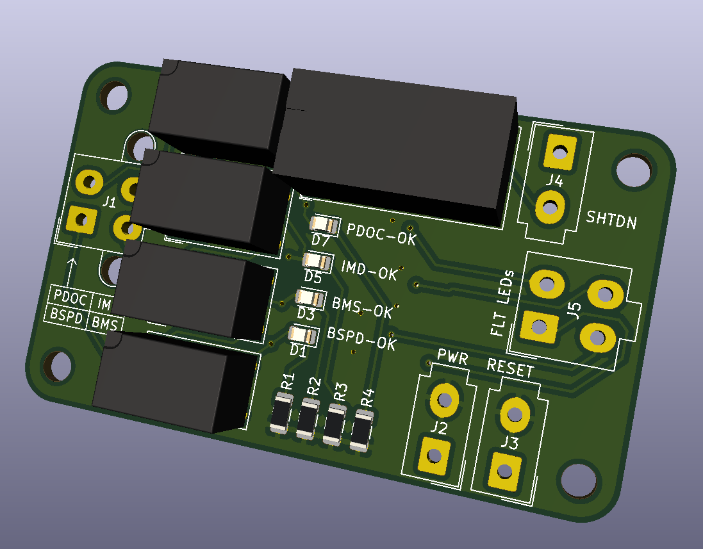

# Hard Fault Latch
A shutdown-circuit component.

The **Hard Fault Latch (HFL)** is a device that breaks the *Shutdown Circuit* when a *Hard Fault* is detected. These are faults generated by the IMD, BMS, BSPD PDOC-temperature, and BOTS. A Hard Fault is any fault that will deactivate the Tractive System, and cannot be reset by the driver.
The HFL is built upon relay-logic because it is easy to understand, reliable and hardened against noise and voltage transients.

An operator must press the HFR button each time the vehicle is powered-on, before the Tractive System can be activated.

Additionally, the HFL passes hard-fault statuses for the IMD, BMS, BSPD and PDOC (**not** BOTS) to the CCU for logging and dash-display.

# Technical Specifications
**ToDo**

# Design Justification
The final output relay must be capable of carrying sufficient current to power an AIR, and be a DPDT type. The smallest readily-available relay found was an OMRON G2R which is rated for 5A.
