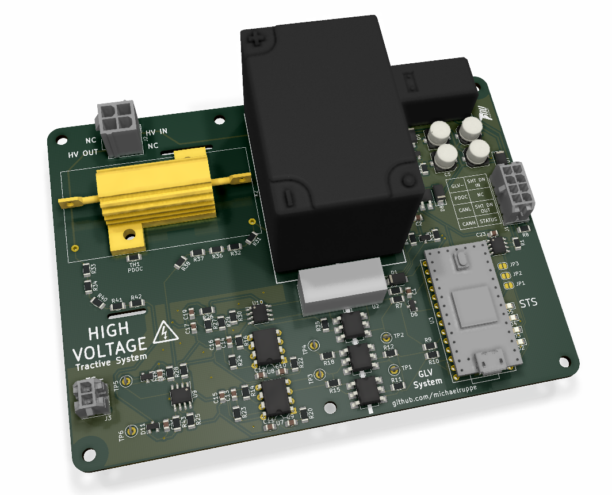
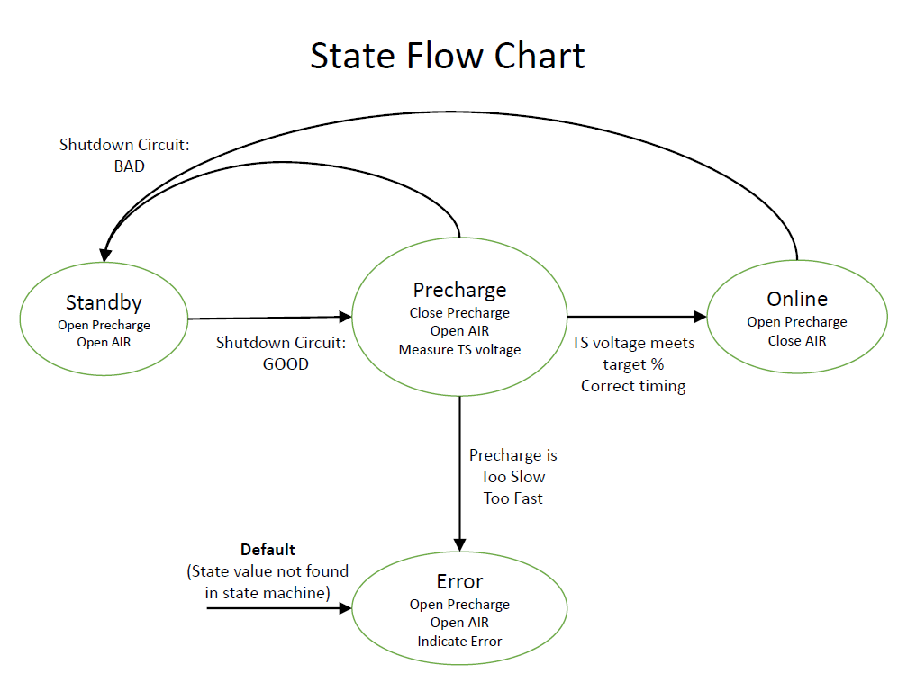
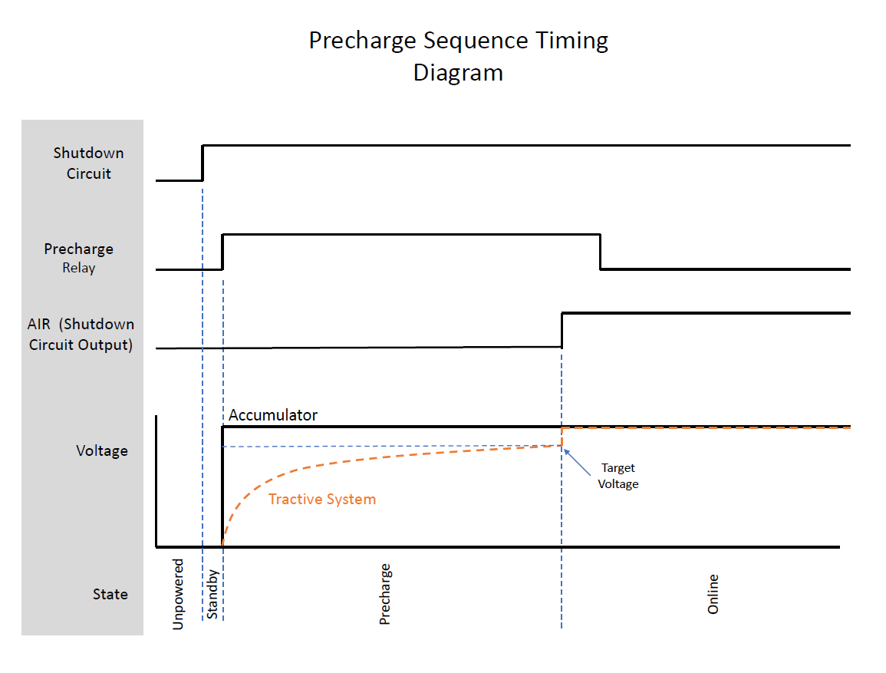
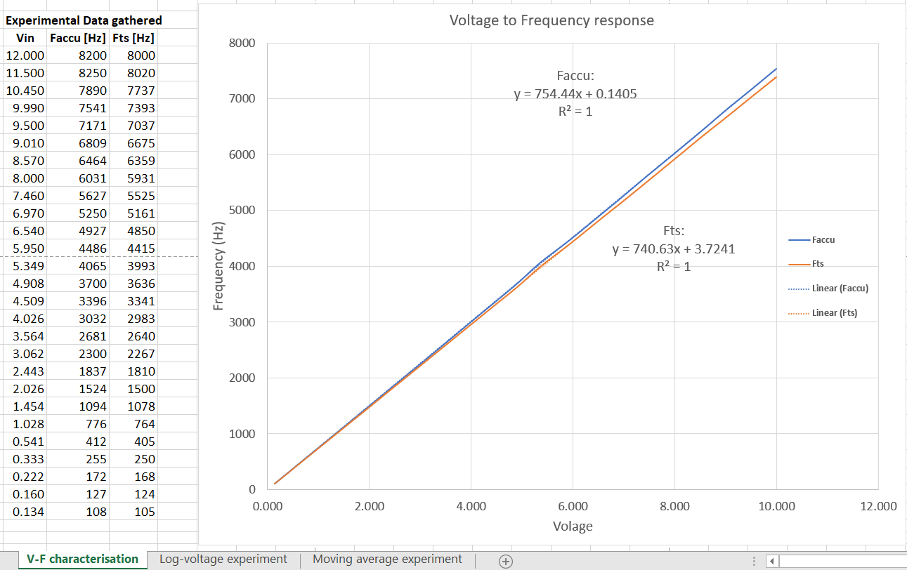
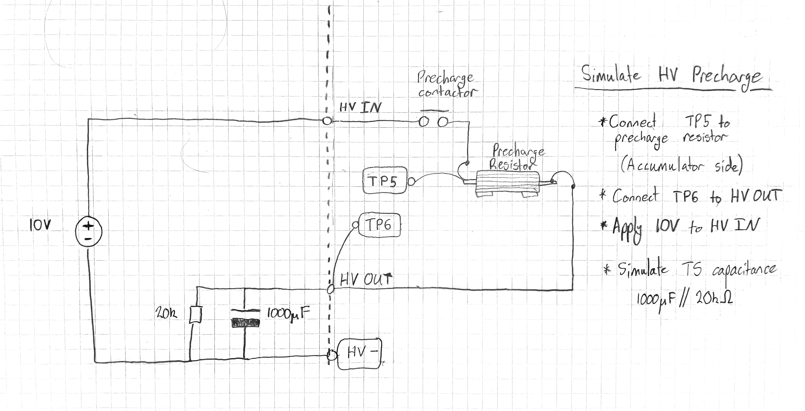
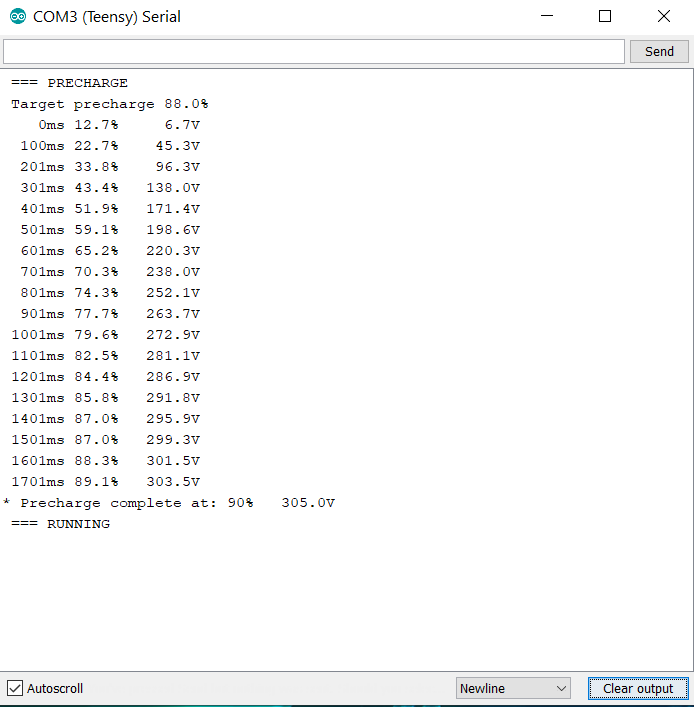
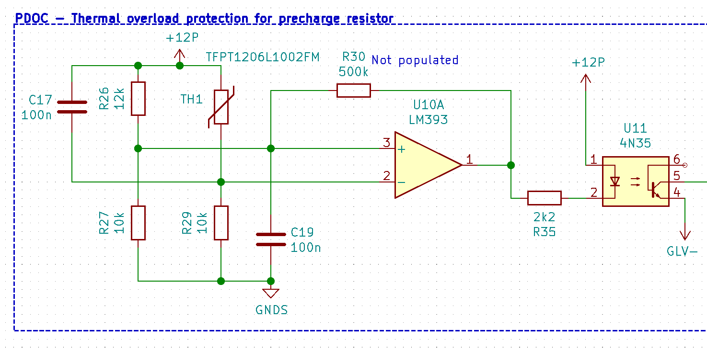
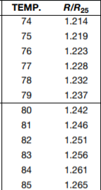
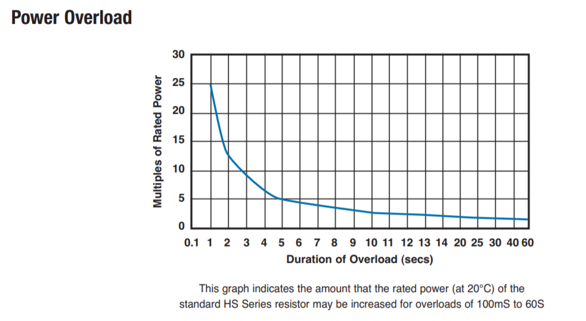
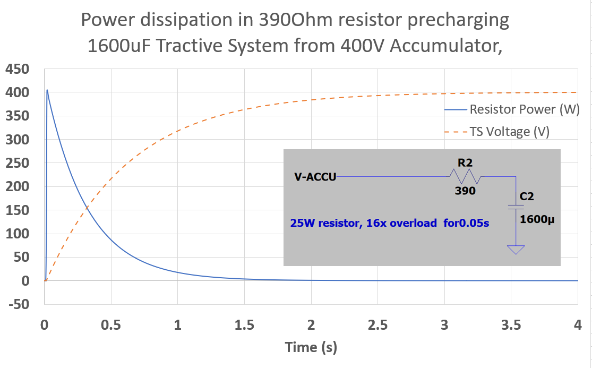

# Precharge

**[Watch the walkthrough video](https://www.youtube.com/watch?v=6-RndXZ5mR4)**

A device to precharge the Tractive System. This prototype features voltage feedback to protect AIRs. In open-loop systems, if a wiring fault develops (eg. precharge resistor is disconnected or discharge is stuck on) then the precharge is ineffective and AIRs may become damaged.

Figure 1: The prototype Precharge module

**Important Directories / Files**
- [code/precharge](code/precharge) - The source code
- [docs/schematic-v1.1.pdf](docs/schematic-v1.1.pdf) - The schematic, as built.
- [docs/pinout-v1.1.pdf](docs/pinout-v1.1.pdf) - Pinout diagram with connection descriptions.
- [docs](docs) - Data collected during commissioning, image assets for this document.
- [Precharge](Precharge) - The PCB design files

## Contents

- [Specifications and Features](#Specifications-and-Features)
- [Operation](#Operation)
- [Commissioning Steps - Precharge](#Commissioning-Steps-Precharge)
  - [Characterise Voltage-Frequency Relationship](Characterise-Voltage-Frequency-Relationship)
  - [Simulate Precharge](#Simulate-Precharge)
  - [Results](#Results)
- [Commissioning Steps - PDOC](#Commissioning-Steps-PDOC)
- [How to modify this design](#How-to-modify-this-design)
- [Recommendations](#Recommendations)

## Specifications and Features
- Wide input voltage 0 - 600V
- Powered by shutdown circuit: 12V
- Integrated PDOC
- Isolated HV measurement
- CAN interface (provisional) for status output
- Serial interface for status and commissioning data
- FSAE one-size-fits-all. This module is capable of precharging any voltage accumulator (within FSAE rules) without significant hardware/software rework. To modify for a new accumulator/tractive-system, select appropriate precharge resistor and update relevant software parameters, discussed in [How to modify this design](#How-to-modify-this-design)

## Operation
A brief description of the Precharge logic follows. Refer to *Figures 2 & 3* for state-flow information.
- Initialise in `State: Standby` and monitor for a stable Shutdown Circuit.
- If Shutdown Circuit is stable, enter `State: Precharge`:
  - Close the precharge relay
  - Monitor Accumulator voltage and Tractive System voltage
  - Once TSV is close enough to AV (eg >95%), precharge is complete
  - If precharge is too fast or too slow, a fault is likely present eg. Wiring fault, discharge stuck-on, stuck relay.
- If precharge completed with no errors, proceed to `State: Online`:
  - Enable the AIR, open precharge relay

If at any point the Shutdown Circuit voltage becomes too low, enter `State: Standby`

Figure 2: A top-level look at the state-flow behaviour

Figure 3: precharge sequence timing. When the TS voltage reaches the target voltage, precharge is complete and the AIR closes. The target voltage should be 90-95% of the Accumulator voltage

## Commissioning Steps - Precharge
*Refer to the [docs/schematic-v1.1](docs/schematic-v1.1.pdf) for component and test-point references.*

*Refer to [docs/Experiments.xlsx](docs/Experiments.xlsx) for sample data collected during prototype construction.*

This section describes the steps taken to construct and characterise the Precharge Module. Repeat these steps as necessary when re-commissioning later versions of the circuit.

### Characterise Voltage-Frequency Relationship
- Assemble power supply components and V-F converter circuitry `U5 - U9`.
- Characterise voltage-frequency performance: perform V-F experiment `code/01-v-f-experiment` *Refer to Figure 4 for sample data collected during prototype construction*
  - Apply 0.15-10V at V-F inputs: `TP5, TP6`.
  - Record output frequencies: `TP1, TP2` vs input voltages.
  - Create linear fit and record the gain and offset parameters.
  - Update [code/precharge/measurements.cpp](code/precharge/measurements.cpp) with the linear-fit parameters: `V2F_slope_accu, V2F_ofs_accu, V2F_slope_ts, V2F_ofs_ts`
- If resistors `R31,R32,R36-39` or `R33,R34,R40-R3` are different to schematic:
  - Find the gain of these voltage dividers: eg `Gain = R39/(R31+R32+R36+R37+R38+R39)`
  - Update [code/precharge/measurements.cpp](code/precharge/measurements.cpp): `gainVoltageDivider` with the new gain value.

  

  
  
Figure 4: Results from the V-F experiment - data collected from the prototype during construction. The V-F response is extremely linear. Expect f(0V) = 0Hz, which is supported by very small y-intercept constants. While the V-F converter circuits are nominally identical, they should be characterised separately to account for component tolerance.

  

### Simulate Precharge
Here, we simulate a precharge sequence using low voltages that bypasses the prescaling voltage dividers.

Figure 5: Simulate a precharge sequence using a low voltage. The prescaling voltage dividers are bypassed by connecting Testpoint:TP5 to the switched accumulator voltage; and Testpoint:TP6 to the HV OUT connector.

*Voltages listed are referenced to the `GNDS` net, connector `J3` labelled `TS-`*
- Connect a known capacitive load eg 1000uF to `HV OUT`. Include a large parallel resistance (eg 20k) for capacitor discharge.
  - The voltage divider created by this resistance and the precharge resistor `R46` will limit the maximum voltage seen at capacitor. Large resistances will reduce this effect, but the capacitor will discharge more slowly during this test.
- Bypass the prescaling voltage dividers:
  - Connect `TP5` to precharge resistor (accumulator side)
  - Connect `TP6` to `HV OUT`
- Apply 4-10V to `HV IN`. Exact voltage will depend on accumulator voltage to be simulated: Accumulator Voltage multiplied by `gainVoltageDivider` (0.015 from prescribed components) gives this voltage.
- Monitor serial data from the microcontroller via USB
- Power the circuit at `J1`
- Monitor precharge behaviour in serial console and note precharge percentage and duration.
- Modify and upload [code/precharge/precharge.ino](code/precharge/precharge.ino) as necessary. Relevant parameters are:
  - `MIN_EXPECTED`[ms] The minimum allowable precharge time. Times faster than this are likely due to wiring fault.
  - `MAX_EXPECTED`[ms] The maximum allowable precharge time. Times slower than this are likely due to wiring fault, stuck discharge circuit.
  - `TARGET_PERCENT`[%] Precharge to this percentage of accumulator voltage.
    - The discharge resistance used during this simulation affects the maximum TS voltage attainable. I found a maximum voltage of only 90% when using Precharge:390Ohm and discharge 4k7.

### Results
A precharge sequence was simulated following the above procedure with results shown in *Figure 6*. Simulated voltages were measured accurate to the nearest volt.

**Parameters:**
- V Accumulator: 5.05V (336V equivalent)
- Tractive system capacitor: 1000uF
- Tractive system discharge capacitor: 4k7 (connected in parallel with capacitor. Larger value as in Figure 5 is preferred)
- `gainVoltageDivider`= 0.015 ([code/precharge/measurements.cpp](code/precharge/measurements.cpp))
- Target precharge percentage: 88.0 (discharge resistor is only one order of magnitude larger than 390Ohm precharge resistor)

Figure 6: Results from a simulated precharge. Here, the accumulator was simulated with 5.05V => 337Vequiv. The TS voltage at TP6 reached 4.561V => 304Vequiv. which is 90.2% as indicated. The precharge finished at 90% instead of 88% because some settling time is imposed by the program.

Of note are the seemingly high precharge percentages observed between 0-200ms. These are artifacts of moving average filters used to smooth voltage measurements and reject spurious measurements. Since the smoothed accumulator voltage does not rise instantaneously, the precharge voltage represents a significant percentage in early stages of the precharge cycle.

## Commissioning Steps - PDOC
The Precharge module includes an integrated thermal overload protection (PDOC) (Figure 7). A thermistor `TH1` monitors the precharge resistor temperature. As temperature increases, the inverting-input voltage of comparator `U10A` rises. Once the voltage at the inverting input rises above the reference voltage (noninverting input) the PDOC will trip. The reference voltage created by `R26` and `R27` therefore sets the temperature threshold. If `R27` = `R29` then select `R26` to be equal to the value of `TH1` at the desired trip-temperature. Referring to thermistor data in Figure 8, for a trip-temperature of eg. 80 degC, `R26` should be about 12kOhm.

Figure 7: The Precharge Overload Circuit monitors the temperature of the precharge resistor and triggers a fault if the temperature becomes too high. R26,R27 set the threshold temperature, TH1 is the temperature-monitoring thermistor.

Figure 8: The thermistor response. R_25 is 10kOhm for the selected device. At 80 degrees Celcius the resistance will be 1.242 x 10kOhm = 12.4kOhm

## How to modify this design
When moving to a new tractive system configuration and/or accumulator voltage, the only hardware component that may require respecification is the Precharge Resistor `R46`. A HS25 series resistor ([datasheet](datasheets/TE-Connectivity-Type-HS-Series-Resistor-1773035_C)) from TE Connectivity is specified for this component - available in a large range of resistances. As per the datasheet, these devices are capable of short-duration overloads many times in excess of their continuous-duty rating. It is likely that only the resistance will need to be respecified, ie. select a  HS25 family resistor of the appropriate resistance.

Short term overloading of a power resistor is acceptable. This design relies on short term overloading to keep the power resistor small, light and cheap.
 (Graphic Source: TE Connectivity Type HS datasheet)

In 2020, NU Racing specified a 400V accumulator and a TS capacitance of 1600uF. Using these as design constraints, a 390Ohm precharge resistor was selected to precharge the TS quickly without excessive overload. As seen below, the resistor is overloaded to 400W (16 times its rating) for a very brief period at the start of a precharge sequence. After approximately 1 second the resistor is no longer overloaded. The initial precharge current(~1A) is well within the capacity of the precharge contactor. The resistance is above the minimum required for 2020 motorcontrollers (47 Ohm).

A 390Ohm 25W resistor precharges the TS to 95% in about 2.5 seconds, experiencing a brief 16x overload. Overloads of this nature are acceptable for the selected family of power resistors and allow cheaper, smaller, low-power resistors to be specified.

Once the appropriate resistor has been selected, follow the [Simulate Precharge](#Simulate-Precharge) steps to identify any software parameters that require modification.

## Recommendations & ToDo

**V-F Conversion**: Either include offset in V-F converter circuit so that min frequency is eg ~100Hz instead of 0Hz ([Datasheet](https://www.ti.com/lit/ds/symlink/lm331.pdf): Figure 14) or replace V-F converters with a microcontroller programmed for the same task. The challenge is that low frequencies require a long timeout period. Applying a 100Hz offset means the longest timeout would be 10 milli-seconds. The current solution works well, using a combination of outlier rejection and Exponential Moving Average filters.

**PCB**:
The footprint assigned to the 4N35 optocouplers is slightly off. Serviceable, but not perfect. Consider re-assigning the footprint.
