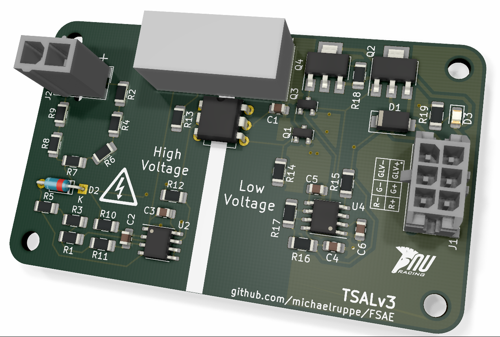

# FSAE

Hardware projects for the FSAE Electric 2019/2020 competition (Australia).

## [TSAL](TSALv3)
A light that indicates presence of dangerous voltage within the Tractive System

The third iteration of the TSAL driver. 

Watch a [video walkthrough](https://youtu.be/bgW9xbbovIY) explaining the circuit operation and design decision.

## [Precharge](Precharge)
A device to precharge the Tractive System. This prototype features voltage feedback to protect AIRs. In open-loop systems, if a wiring fault develops - eg. precharge resistor is disconnected - then the precharge is ineffective and AIRs may become damaged.

The prototype Precharge module

 ## [HFL (Hard Fault Latch)](HFL)

 Latches momentary faults that are required to shutdown the EV.
