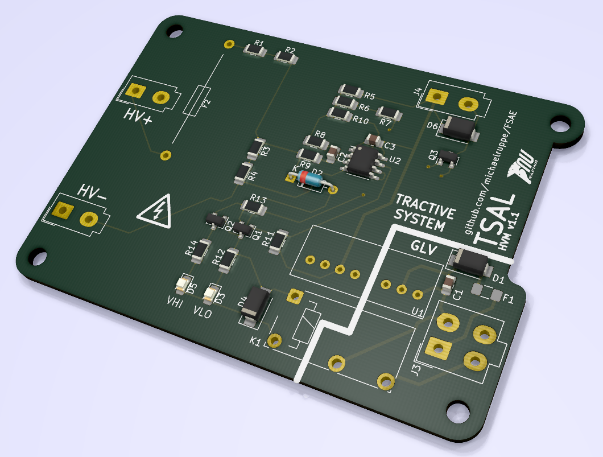
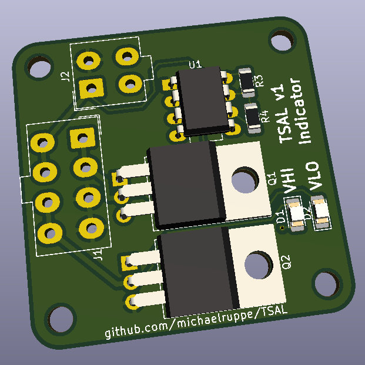

# TSAL
A comparator-based TSAL design for FSAE Electric 2019
*This repo is for the design of a system required in the Formula SAE competition 2019, and so will use common nomenclature specified in the [2019 rules v2.1](http://www.fsaeonline.com/cdsweb/gen/DocumentResources.aspx)*

The *Tractive System Active Light* is a red/green indicator light that indicates the presence of high-voltage in the Tractive System. The following design for a TSAL driver is split across two modules. The High-Voltage Measurement module (HVM) and the Indicator Module (DRV). The HVM connects to the output of the AIRs, and is located in the accumulator housing. The HVM is responsible for detecting whether Tractive System voltage is above or below the safe threshold.

## High-Voltage Measurement (HVM)

The HVM has been designed to mount above the IMD, using the same mounting-hole dimensions. This will likely require conformal coating of the board and an intermediate insulating material to meet regulation EV.6.1.5 and EV.6.1.7

The HVM is designed to **not** be user adjustable. Resistive dividers R1, R2, R3, R4 and R5, R6, R7 may be used to set the trigger threshold for the onboard comparator. As specified, the board should safely handle 400V at the HV inputs (untested). Diode D1 begins conducting when approximately 200V is present at HV inputs - effectively limiting the input voltage of the comparator.

### Pinout

| Parameter                  | Value             |
|----------------------------|-------------------|
| Max Voltage (HV+ - HV-)    | 200V DC           |
| Switching threshold (HVin) | 60V DC            |
| Supply Voltage             | 12V DC            |
| Output                     | Switched Contacts |
| HV < 60V                   | OPEN              |
| HV > 60V                   | CLOSED            |

### Assembly notes
Many parts of the v1 design are provisional.
**ToDo - assembly instructions**

### Design justification
**ToDo**

## Indicator module (DRV)

The Indicator module is powered by the GLVS and controls the behaviour of the red/green TSAL. It is controlled by a single input which is pulled low by the action of the HVM. Each channel is capable of several amps and should be suitable for driving 12V LED assemblies or even incandescent bulbs.

### Pinout

| J1  | LED Connection |
|-----|----------------|
| 1   | GRN+           |
| 2   | GRN+           |
| 3   | GRN-           |
| 4   | GRN-           |
| 5   | RED+           |
| 6   | RED+           |
| 7   | RED-           |
| 8   | RED-           |

| J2 |                     |
|----|---------------------|
| 1  | +12V                |
| 2  | GND                 |
| 3  | VHI signal from HVM |
| 4  | N.C.                |
